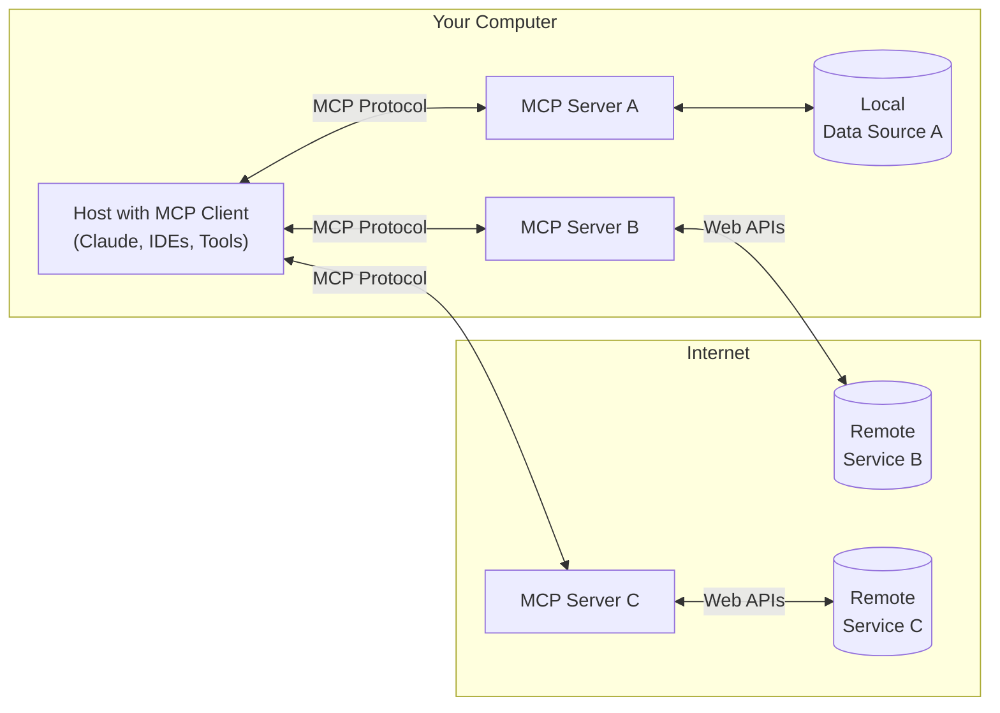

# MCP (Master Context Protocol) Module

> Get started with the Model Context Protocol (MCP)

MCP is an open protocol that standardizes how applications provide context to LLMs and AI agents. Think of MCP like a USB-C port for AI applications—providing a standardized way to connect models and agents to different data sources and tools.

## Why MCP?

MCP helps you build agents and complex workflows on top of LLMs and AI models. It provides:

- Pre-built integrations that your AI agent or model can directly plug into
- Flexibility to switch between LLM providers and vendors
- Best practices for securing your data within your infrastructure

## General Architecture

At its core, MCP follows a client-server architecture where a host application connects to multiple servers:

- **MCP Hosts**: Programs like Claude Desktop, IDEs, or AI tools that want to access data through MCP
- **MCP Clients**: Protocol clients that maintain 1:1 connections with servers
- **MCP Servers**: Lightweight programs that each expose specific capabilities through the standardized Model Context Protocol
- **Local Data Sources**: Your computer's files, databases, and services that MCP servers can securely access
- **Remote Services**: External systems available over the internet (e.g., APIs) that MCP servers can connect to

## Implementation in This Project

This MCP module is intended as a starter for providing guidance and context for prompting and implementing web app solutions for AI development agents and models (like Claude, Cascade, etc). It is designed to be iteratively developed and updated as your needs evolve.

### Intended Usage
- Serve as a reference and starting point for integrating MCP concepts into your .NET solution
- Enable current AI development agents and models to access project context, resources, and tools via a standard protocol
- Lay the foundation for future LLM and advanced AI integration

### Next Steps
- Add your own context, integrations, and endpoints to this module as you develop your project
- Refer to the official MCP documentation and examples: https://github.com/modelcontextprotocol
- Update this module iteratively as your requirements grow

---

*This module is a living document and codebase. Continue to enrich it with your own context, workflows, and integrations as you build your AI-powered solutions.*
